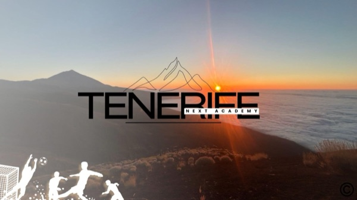
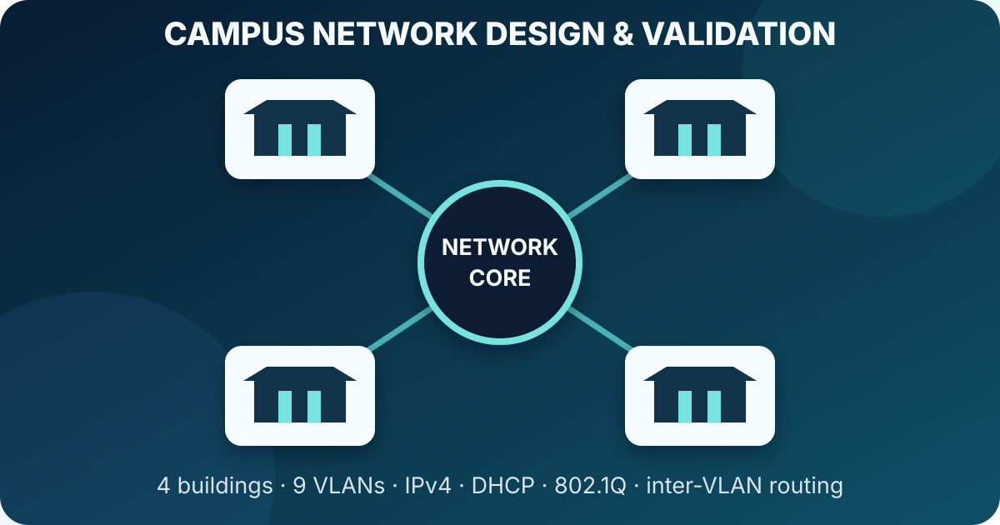

# Daniel Peña Hartwig

IT + AI double major at Carroll University, graduating in May 2027. I work across product, solutions, and applied AI, with projects using Python, TypeScript, Next.js, Supabase, and SQL.

## Selected work

<table>
  <tr>
    <td width="96"></td>
    <td><strong><a href="https://github.com/daniph04/investcircles-case-study">InvestCircles</a></strong> Product decisions, privacy design, technical architecture, and test-backed web and iOS development. Public case study; source remains private.</td>
  </tr>
  <tr>
    <td width="96"></td>
    <td><strong><a href="https://github.com/daniph04/imc-prosperity-4-case-study">IMC Prosperity 4</a></strong> Independent five-round entry covering Python strategy research, backtesting, manual decisions, and transaction-cost analysis; #750 of 18,803 worldwide (top 4%) and #9 in Spain.</td>
  </tr>
  <tr>
    <td width="96"></td>
    <td><strong><a href="https://github.com/daniph04/tenerife-next-academy-case-study">Tenerife Next Academy</a></strong> Delivery and ongoing support of a Next.js website for a football-training project in Tenerife. Public case study; source remains private.</td>
  </tr>
  <tr>
    <td width="96"></td>
    <td><strong><a href="https://github.com/daniph04/cisco-campus-network-case-study">Cisco Campus Network</a></strong> Individual Packet Tracer project for a four-building university campus: nine VLANs, IPv4 subnet planning, 802.1Q trunks, DHCP, inter-VLAN routing, and command-level validation.</td>
  </tr>
</table>

## Focus

Product development · Solutions · Applied AI · Python · TypeScript · Requirements analysis · Testing

Spanish (native) · English (professional) · German B2
